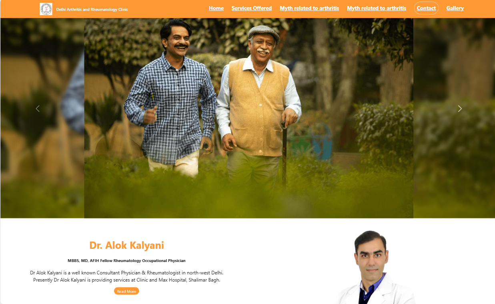

<h1 align="center">
DoctorCare 👨‍⚕️
</h1>

## 📝 Description

DoctorCare is a professional website designed for Dr. Alok Kalyani's medical clinic. The website provides essential information about the clinic's services, educational content, and contact details, offering patients an easy and intuitive way to connect with the clinic.

- **Live site:** [Visit DoctorCare](#) *(Add the actual URL here)*

## 🚀 Technologies Used

This project was developed using modern web development technologies to ensure high performance and responsiveness:

- **HTML** - For the structure and content.
- **CSS** - For the styling and layout.
- **JavaScript** - For interactivity and dynamic content.

## 📚 Libraries and Tools

Several libraries and tools were utilized to enhance the development process and user experience:

- [Google Fonts](https://fonts.google.com/) - To provide aesthetically pleasing typography.
- [ScrollReveal](https://scrollrevealjs.org/) - For smooth and engaging animations on scroll.
- [Bootstrap](https://getbootstrap.com/) *(Optional)* - For responsive design and layout.

## 💻 Author

<table align="center">
<tr>
<td align="center">
<a href="https://github.com/gaurav1021">
 

<b>Gaurav Mangal</b>

</a>

<a href="https://www.linkedin.com/in/gaurav-mangal-0141981a8/">
<i class="bi bi-linkedin"></i> LinkedIn
</a>

</td>
</tr>
</table>

-----

<h3 align="center"> Developed by <a href="https://www.linkedin.com/in/gaurav-mangal-0141981a8/">Gaurav Mangal</a> ☕</h3>
